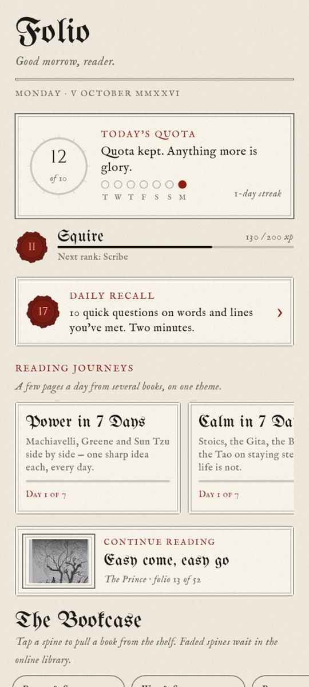
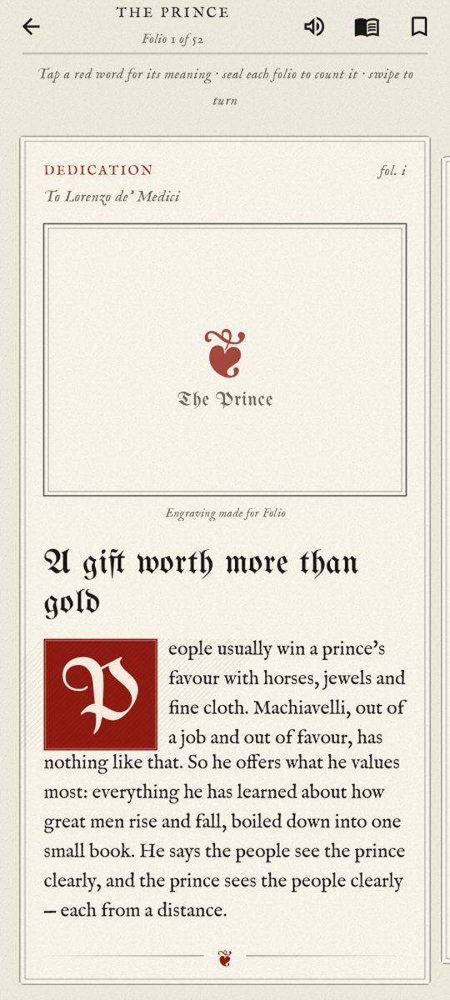
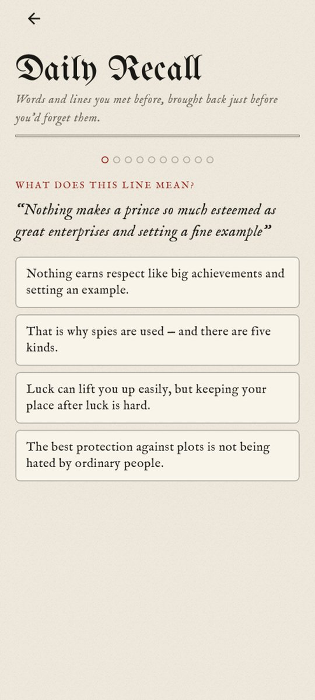
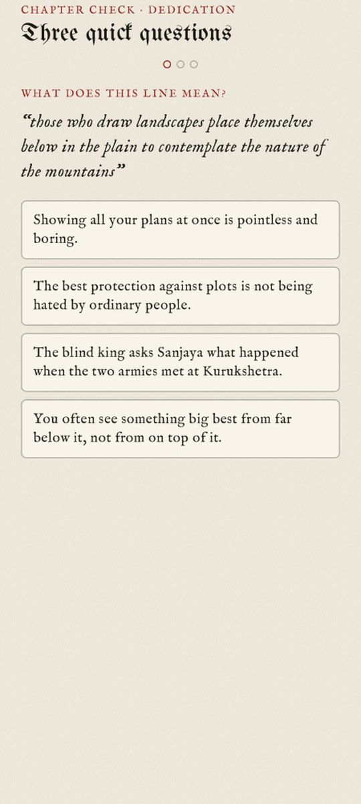
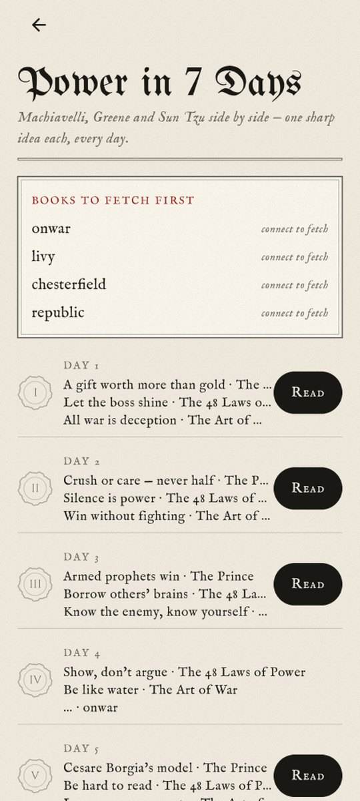
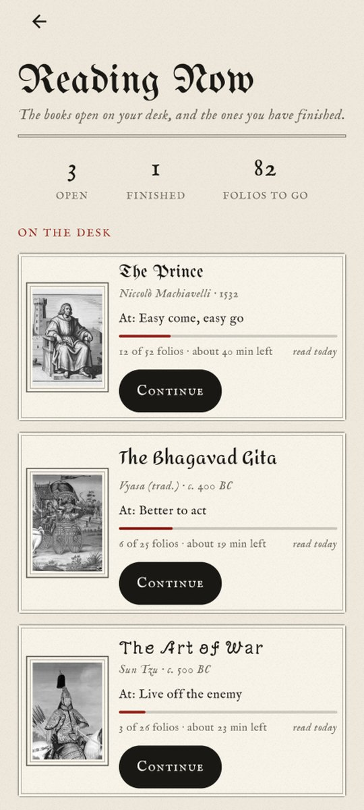
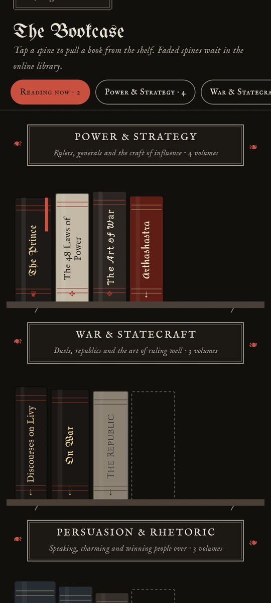
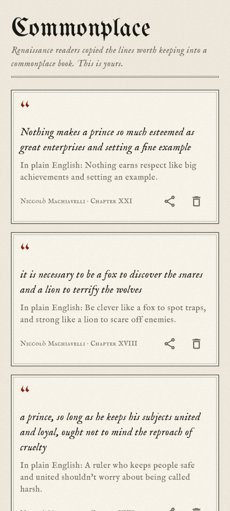
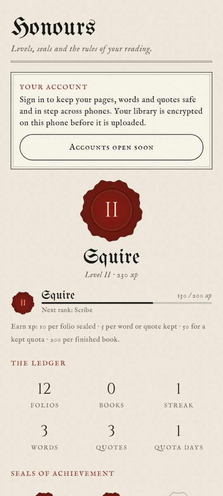
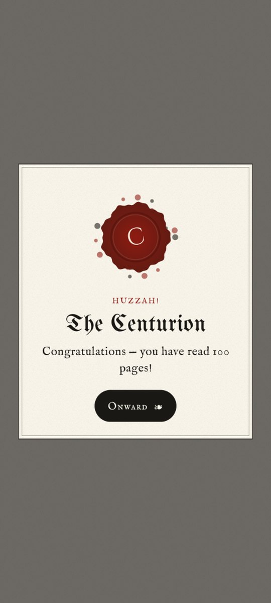

# 𝔉𝔬𝔩𝔦𝔬

### The world's greatest hard books, one beautiful page at a time.

**Machiavelli, Sun Tzu, the Bhagavad Gita, Marcus Aurelius, Plato, Jung, the Thirukkural and 20+ more — turned into short illustrated flashcards you can actually finish.**

[**⬇ Download Folio for Android (free)**](https://github.com/purvalsingh/folio/releases/latest/download/Folio.apk) · native Kotlin · no ads · no tracking · works offline

  

---

## You've always meant to read *The Prince*.

You bought it. You opened it. Page three, a sentence 90 words long, and you were back on your phone.

**Folio fixes that.** Every classic is cut into one-minute folios: a plain-English summary, the author's *real* words (checked word for word against the original), and a period engraving on every page. Ten folios a day and you finish a book that's defeated people for 500 years.

## What's inside

| | |
|---|---|
| 📜 **31 books, 10 shelves** | Power & Strategy · War & Statecraft · Persuasion · Stoic Wisdom · Eastern Paths · **Indian Wisdom** · Mind & the Crowd · The Human Mind · Love & Human Nature · Courtly Wisdom. New books land in the app without updating. |
| 🖋 **Typeset like the original** | Machiavelli in Renaissance blackletter, the Gita in Devanagari-inspired type, Clausewitz in Prussian Fraktur, Franklin in colonial Pica, each book with its own era, drop cap and fleuron. |
| 🔎 **Tap any hard word** | *Clemency? Patrimony?* A plain meaning plus an everyday example, in **English or Hindi**. Add it to your own Lexicon. |
| 💬 **Tap any quote** | "What does this actually mean?" A simpler version plus where you'd see it in real life. |
| 📖 **Reading Now** | Every book you have open, with progress, minutes left and when you last read it, plus the ones you have finished. |
| 🧠 **Daily Recall** | Spaced repetition brings back your words and quotes right before you'd forget them. |
| ✅ **Chapter checks** | Three quick questions when you finish a chapter. Pass and the chapter gets a wax seal. |
| 🗺 **Reading Journeys** | *Power in 7 Days*, *Calm in 7 Days*, *Win People Over in 5 Days*: three pages a day from several books on one theme. |
| 🔊 **Read aloud** | Your phone's own voice reads any folio to you. |
| 🏆 **Quotas, streaks, levels** | A daily goal, streaks, ranks from *Page* to *Prince of Letters*, and celebrations ("You have read 100 pages!"). |
| 🖼 **Share quote cards** | Any quote becomes a printed plate ready for WhatsApp or Instagram. |
| 🌅 **Home-screen widget + reminder** | Quote of the day on your home screen and a gentle nudge at your chosen hour. |
| 📕 **Bind your own PDF** | Import any PDF and Folio binds it into flashcards. |
| 🌙 **Lamplight mode, text size, line spacing** | Comfortable at midnight, comfortable at 60. |
| 🔐 **Private by design** | Everything stays on your phone. Optional sync (coming soon) is end-to-end encrypted with AES-256-GCM before anything leaves it. |

## See it

   

    

*A shareable quote card, made in one tap.*

## The shelves

**Power & Strategy**: The Prince · The 48 Laws of Power · The Art of War · Arthashastra  
**War & Statecraft**: On War · Discourses on Livy · The Republic  
**Persuasion & Rhetoric**: The Art of Public Speaking (Carnegie) · Franklin's Autobiography · Chesterfield's Letters  
**Stoic Wisdom**: Meditations · Enchiridion · On the Shortness of Life  
**Eastern Paths**: Bhagavad Gita · Tao Te Ching · Dhammapada  
**Indian Wisdom**: Panchatantra · Hitopadesha · Thirukkural  
**Mind & the Crowd**: The Crowd · Beyond Good and Evil · As a Man Thinketh  
**The Human Mind**: Talks on Habit (William James) · Dream Psychology (Freud) · The Expression of the Emotions (Darwin) · Psychology of the Unconscious (Jung) · The Red Book  
**Love & Human Nature**: The Art of Love (Ovid) · Emerson's Self-Reliance  
**Courtly Wisdom**: The Art of Worldly Wisdom (Gracián) · Maxims (La Rochefoucauld)  

*In the bindery:* Fortune & Wealth · Poetry of Life · Myth & Hero.

## Honest by design

- **Every quote is real.** A build step checks each one against a public-domain source text and refuses to ship a misquote.
- **Every picture is public domain**, credited on the page (Wikimedia Commons, museum open-access collections).
- **No ads, no trackers, no account needed.** Accounts will be optional and only for sync.

## Install

1. Download [**Folio.apk**](https://github.com/purvalsingh/folio/releases/latest/download/Folio.apk) on your Android phone (Android 8+).
2. Open it and allow "install from this source" when asked.
3. That's it. Folio updates itself: new versions and new books appear inside the app.

**Like it?** ⭐ Star the repo so more readers find it, and tell us which book should be bound next in [Issues](https://github.com/purvalsingh/folio/issues).

---

<b>For developers</b>

Kotlin + Jetpack Compose, no WebView. Content pipeline in `research/` (`*_content.py` → `folio_build.py`, verbatim quote verification, Commons image fetch). Screenshots are Paparazzi snapshots (`./gradlew recordPaparazziDebug`).

- `./release.sh books`: publish new or corrected books to the online library.
- `./release.sh 1.4 "What's new"`: build, sign and release a new app version (needs the signing key in `~/.folio-signing/`, never committed).
- Online library: `library/catalog.json`, read by the app on launch; APKs are sha256-verified before install.

Made by <a href="https://purvalsingh.github.io">Purval Singh</a>

